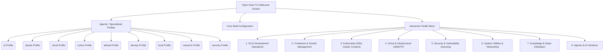

# Open Claw CLI Architecture

> Auto-generated by `scripts/utils/generate-docs.sh`

```mermaid
graph TD
    UI[Open Claw TUI Welcome Screen] --> P[Agentic / Specialized Profiles]
    UI --> C[Core Shell Configuration]
    UI --> TK[Interactive Toolkit Menu]

    P --> P_ai(ai Profile)
    P --> P_claude(claude Profile)
    P --> P_cloud(cloud Profile)
    P --> P_cortex(cortex Profile)
    P --> P_default(default Profile)
    P --> P_devops(devops Profile)
    P --> P_local(local Profile)
    P --> P_research(research Profile)
    P --> P_security(security Profile)

    TK --> TK_1["1. Git & Development Operations"]
    TK --> TK_2["2. Containers & Docker Management"]
    TK --> TK_3["3. Kubernetes (K8s) Cluster Contexts"]
    TK --> TK_4["4. Cloud & Infrastructure (AWS/TF)"]
    TK --> TK_5["5. Security & Vulnerability Scanning"]
    TK --> TK_6["6. System Utilities & Networking"]
    TK --> TK_7["7. Knowledge & Notes (Obsidian)"]
    TK --> TK_8["8. Agentic & AI Solutions"]
```
